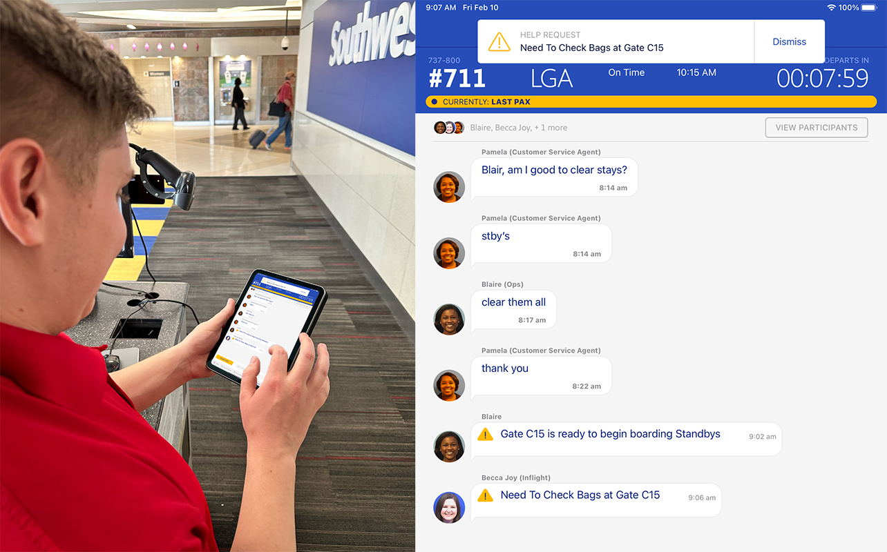
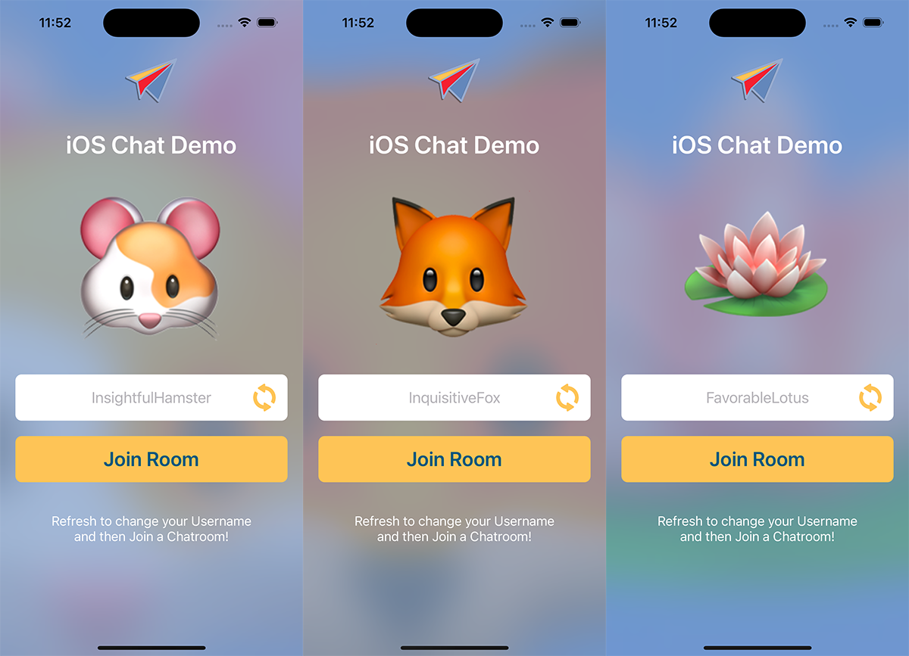
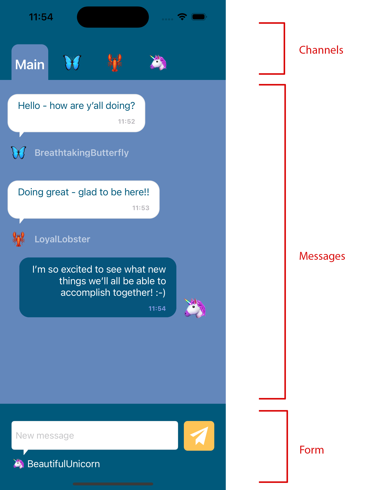

# ♥️ ChatDemo

[](https://opensource.org/licenses/BSD-3-Clause) 

[](https://developer.apple.com)
[](https://developer.apple.com)
[](https://developer.apple.com)
[](https://console.firebase.google.com/)

#### Swift, UIKit chat feature for iOS

## 💡 Concept

Real-time chat message feature that can be added to any iOS project.

## 📜 Background

We designed a chat feature to allow our co-hearts to talk to one another and quickly solve problems. We found that every time an Ops Agent needed to run down the jetbridge to talk to a Flight Attendant, it would take about a minute and a half. Multiple trips could cause a flight delay, which could impact our network - one delayed flight would cascade and cause delays or require the pilot to make up the time by burning extra fuel.

Tools like real-time chat helped our co-hearts, and in turn had a real impact on our business.



## ⚙️ Installation

To test and run this app, you will need to make a Firebase instance. We will be using Firestore to store the messages that will be sent, and use Firestore listeners to support the real-time messaging notifications.

To install, download the code for this project and then:

1. [Add Firebase to iOS](https://firebase.google.com/docs/ios/setup)

2. Download and add the `GoogleService-Info.plist` file to the project.

3. Setup [anonymous authentication](
https://firebase.google.com/docs/auth/ios/anonymous-auth)

4. Compile and run in Simulator!

## 💻 Code Walkthrough

There are two main screens for this demo app. 

### Login Screen

The first is `LoginViewController.swift` which is also set up in the `Main.storyboard`:



In our normal apps, we use LDAP to authorize the user within our organization, but for this demo we made a simple randomly-generated mock user, which helps with testing.

The `MockUserGenerator.swift` goes into detail of randomly picking an emoji and a username. Tapping `Refresh` will generate a new one, and tapping `Enter Chat` will go to the next screen.

### Chat Screen

The chat screen is broken up into three logical sections:



1. **Channels**: The top bar, containing the people or groups who are able to be chatted with
2. **Messages**: The main message area, where messages for channels will appear
3. **Form**: The chat form (in Web 1.0 parlance), for entering text to submit to a message area

For ease of documentation, we have put the functions and delegates for each of these logical groupings into separate extensions.

### SWAMessaging

The `SWAMessaging` folder contains all of the classes needed to read and write channels and messages to the Firestore instance.

### Shared

And finally, the `Shared` folder contains extensions and UI subclasses that we will be using in other open source offerings. They contain common functions that we use across our other projects.


## 🥚 Easter Eggs

There are a few structures that we left unimplemented in our example UI, as an exercise for anyone looking to integrate those features into their own applications. Features like user roles, requests (which are different from messages as they should be acted upon by someone in the chat channel), read notifications and read indicators, etc. We use these in some of our internal apps, and they can be implemented or modified if you have a similar need.

## 🚀 Future ideas

There are a number of potential features that can be added to make this application more robust, some of which we've implemented into other versions that we have launched internally:

- *Task Management and Collaboration*: Integrate task management features within the chat platform, allowing users to create, assign, and track tasks directly from the chat interface.
- *Chat Bots and AI Assistance*: Integrate AI-powered chatbots to provide automated support and guidance to co-hearts, helping them quickly find answers to common questions or access relevant resources.
- *Voice and Video Chat*: Integrate voice and video chat functionality to enable more engaging and efficient communication between co-hearts, especially in scenarios where text-based chat may not suffice.
- *File Sharing*: Implement a file-sharing feature that allows users to securely send and receive documents, images, and other files within the chat interface, streamlining information sharing and collaboration.
- *End-to-End Encryption*: Enhance the security of the chat platform by implementing end-to-end encryption, ensuring that all messages and files shared within the platform remain private and protected.
- *Customizable Notifications*: Allow users to customize their notification settings, ensuring they receive important updates without being overwhelmed by less critical messages.
- *Message Translation*: Integrate real-time message translation to support communication between co-hearts who speak different languages, fostering a more inclusive work environment.
- *Location Sharing and Geofencing*: Incorporate location-sharing features and geofencing capabilities to help co-hearts coordinate and communicate more effectively during events or emergencies that require real-time location information.

## 💻 Contributors

The following members of Technology Innovation contributed to this project:

|  |
| :---: | 
| Jeffrey Berthiaume  |
| [](https://twitter.com/jeffreality) |
| [](https://linkedin.com/in/jeffreality) |
| [](https://stackoverflow.com/users/71607/jeffrey-berthiaume) |

|  |
| :---: | 
| Justin Léger |
| [](https://twitter.com/justin_leger) |
| [](https://linkedin.com/in/justinleger) |

|  |
| :---: | 
| Ben Smith |
| [](https://linkedin.com/in/benjamin-x-smith-software-eng) |

|  |
| :---: | 
| Courtney Stephenson |
| [](https://linkedin.com/in/courtney-j-kent) |


## 📖 Citations

If you use this software, please cite it using the following metadata:

```
@software {
	title = {SWA Chat},
	author = {Technology Innovation},
	affiliation = {Southwest Airlines},
	url = {https://github.com/SouthwestAir/SWAChat},
	month = {04},
	year = {2023},
	license: {BSD-3-Clause}
	version: {1.0}
}
```
